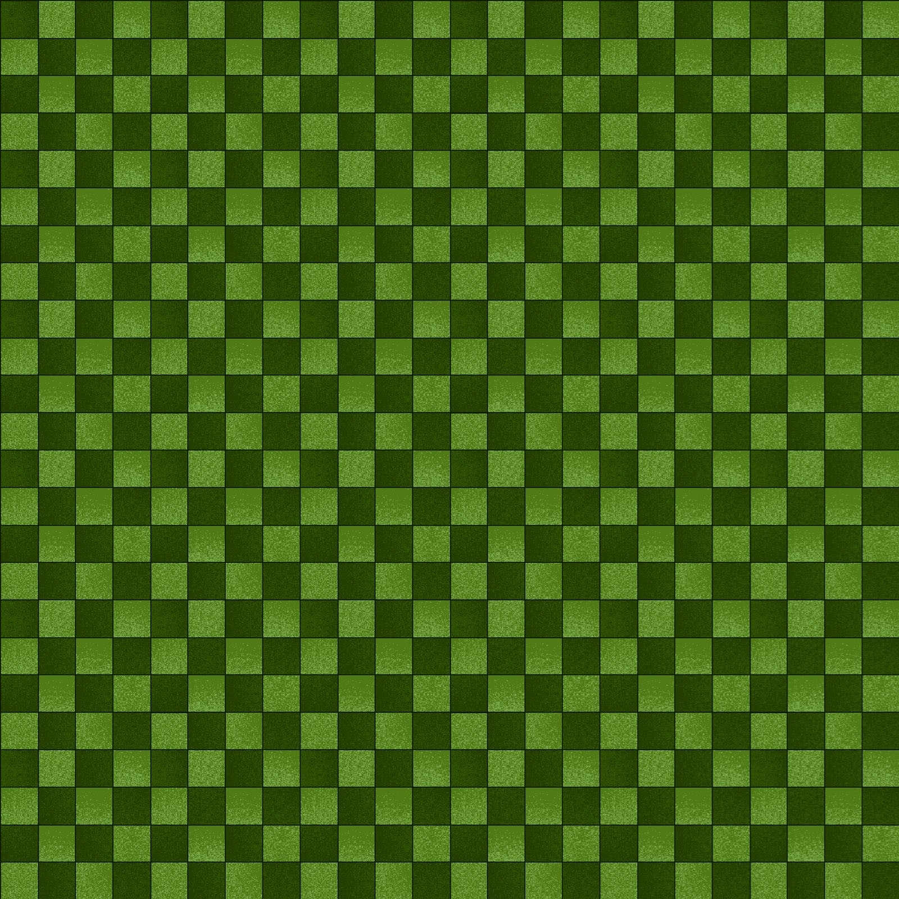

# 🐍 Snake Game

A classic **Snake Game** built in Java using Swing!  
Play directly by downloading the portable version — no Java or installation required 🎮  

---

## 🚀 How to Play

1. Go to the [**Latest Release**](t)[https://github.com/Ahnaf-Labib10/Snake-Game/releases/lates](https://ahnaf-labib10.github.io/Snake-Game/)
2. Download **Snake Game.zip**
3. Extract it to any folder
4. Run `SnakeGame.exe`

✅ Works even if you don’t have Java installed!  
🏁 Eat apples, grow longer, and avoid hitting yourself or the walls!

---

## 🧠 Features
- Smooth snake movement and keyboard controls  
- Score and top-score tracking  
- Dynamic speed increase  
- Background graphics and game-over screen  
- Lightweight portable build (no setup needed)

---

## 🖼️ Preview

---

## 💻 Built With
- Java 23  
- Swing / AWT GUI  
- Launch4j (EXE wrapper)

---

## 🧑‍💻 Author
**Ahnaf Labib**  
📍 Arizona State University  
Made with ❤️ and Java
